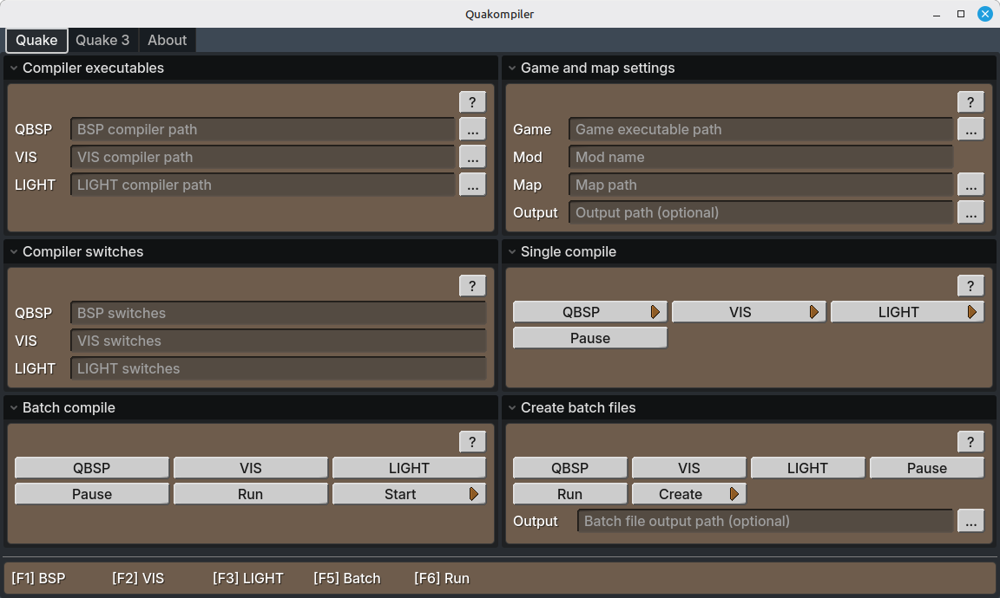

# Quakompiler v0.2

A Quake engine compiler GUI by [Victor Karp](https://victorkarp.com), made in [Godot](https://godotengine.org).

## Features

- Compiling and running Quake 1 and 3 maps with an easy to use GUI
- Compiling multiple stages sequentially
- Custom switches for all stages
- Compiler setups can be exported as executable .bat files on Windows and .sh files on Linux
- Runs natively on Windows and Linux without setup
- Hotkeys for compiling and launching
- Detailed help dialogues
- Full keyboard support - Quakompile can be used without a mouse
- Responsive, resizeable UI
- Easy to edit config.ini file that contains all settings

## Building from source

1. Download the source code
2. Open the project in Godot 4.5.1
3. Project -> Export
4. Export for Windows or Linux. Godot will inform you if you do not have the necessary export templates installed

## License

MIT License, Copyright (c) 2025 [Victor Karp](https://victorkarp.com). See [LICENSE.txt](LICENSE.txt) for the full license.
